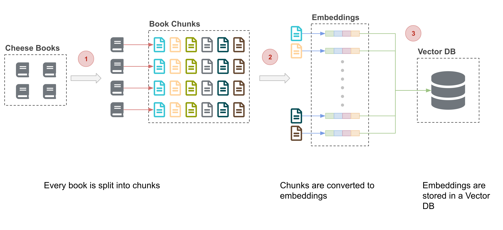
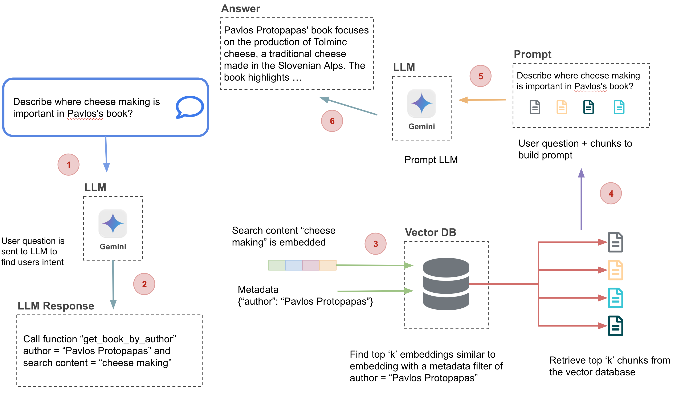

# Cheese App v0: RAG Web App

In this tutorial we will run a Retrieval-Augmented Generation (RAG) web app. The `llm-rag` CLI loads the cheese books into ChromaDB. A FastAPI **api-service** calls Gemini on Vertex AI, and a Next.js **frontend** walks through each RAG step in the browser.

**Step 1: Chunk -> Embed -> Load**



**Step 2: Query -> Embed -> Retrieve -> LLM -> Generate Answer**


## What you'll build

The goal: **answer questions about the cheese books through a web UI, using an LLM grounded in your own vector database**.

1. **Text Chunking**: see how different splitters break the books into chunks.
2. **Vector DB UI**: browse the ChromaDB collections and their chunks.
3. **Chat**: ask questions answered by the LLM using chunks retrieved from the vector DB (RAG).
4. **Cheese Expert Agent**: the LLM picks its own retrieval tool and adds a fun fact from Pavlos.
5. **Pavlos Cheese Model**: the same RAG flow, answered by a fine-tuned model.

---

## Contents

- [Prerequisites](#prerequisites)
- [Build the Vector DB](#build-the-vector-db)
- [Optional: LLM RAG Tutorial](#optional-llm-rag-tutorial)
- [Run API Service Container](#run-api-service-container)
- [Run Frontend Container](#run-frontend-container)
- [Text Chunking](#text-chunking)
- [Vector DB UI](#vector-db-ui)
- [Chat](#chat)
- [Cheese Expert Agent](#cheese-expert-agent)
- [Pavlos Cheese Model](#pavlos-cheese-model)
- [API Endpoints](#api-endpoints)

---

## Prerequisites

- Have Docker installed
- Cloned this repository to your local machine

### Setup GCP Service Account

1. To set up a service account, go to the [GCP Console](https://console.cloud.google.com/home/dashboard), search for **"Service accounts"** in the top search box, or navigate to **IAM & Admin → Service accounts** from the top-left menu.
2. Create a new service account called `llm-service-account`.
3. In **"Grant this service account access to project"** select:
  - **Storage Admin**
  - **Gemini Enterprise Agent Platform User** (listed as "Vertex AI User" in older projects)
4. This will create a service account.
5. Click the service account and navigate to the tab **KEYS**.
6. Click the button **ADD Key (Create New Key)** and select **JSON**. This will download a private key JSON file to your computer.
7. Copy this JSON file into the **secrets** folder and rename it to `llm-service-account.json`.

Your folder structure should look like this:

```text
|-cheese-app-v0
  |-llm-rag               # CLI: chunk, embed, load into ChromaDB
  |-api-service           # FastAPI server (port 9000)
  |-frontend-ai-chatbot   # Next.js app (port 3200)
|-secrets
  |-llm-service-account.json
```

### Create the Docker Network

The API and frontend containers join `cheese-app-network`. Create it once:

```bash
docker network inspect cheese-app-network >/dev/null 2>&1 || docker network create cheese-app-network
```

---

## Build the Vector DB

***Setup**: load the books into ChromaDB. This is the only `llm-rag` step the app needs. Do it once; the data persists across restarts.*

1. Open a terminal inside the `llm-rag` folder.
2. Update `GCP_PROJECT` to your own project ID in `docker-shell.sh`.
3. Run:

```bash
sh docker-shell.sh
```

4. Inside the container, run chunk → embed → load for each chunking method:

```bash
python cli.py --chunk --embed --load --chunk_type char-split
python cli.py --chunk --embed --load --chunk_type recursive-split
```

This will:

- Start ChromaDB at `http://localhost:8000` (container `llm-rag-chromadb`)
- Split each book in `input-datasets/books` into chunks and save them as JSONL files in `outputs`
- Generate embeddings with `gemini-embedding-001` (256 dimensions)
- Load them into the collections `char-split-collection` and `recursive-split-collection`
- Store the data in `llm-rag/docker-volumes/chromadb`, so you don't have to re-run these steps

ChromaDB keeps running after you exit the CLI container, and allows requests from the frontend at `http://localhost:3200`. To stop it, run `docker compose down` inside `llm-rag`.

---

## Optional: LLM RAG Tutorial

***Optional**: not required to run the app. Follow it to learn how the vector DB is built, one step at a time.*

The [LLM RAG tutorial](llm-rag/README.md) runs from the same `llm-rag` container and covers:

- Chunking (character, recursive and semantic splitting)
- Generating embeddings
- Loading embeddings into ChromaDB
- Querying the vector DB
- Chatting with the LLM using RAG
- Agents

---

## Run API Service Container

***Setup**: build and start the API server. It generates embeddings and calls the LLM; it does not connect to ChromaDB.*

1. Open a terminal inside the `api-service` folder.
2. Update `GCP_PROJECT` to your own project ID in `docker-shell.sh`.
3. Run:

```bash
sh docker-shell.sh
```

4. Inside the container, start the server:

```bash
uvicorn_server
```

This will:

- Build the image from `Dockerfile` and install the packages from `Pipfile.lock`
- Mount `../../secrets` into the container at `/secrets`
- Serve the API at `http://localhost:9000`, with auto-reload on changes in `api/`

Go to [http://localhost:9000/docs](http://localhost:9000/docs) to see the API docs.

---

## Run Frontend Container

***Setup**: build and start the Next.js app in dev mode.*

1. Open a new terminal inside the `frontend-ai-chatbot` folder.
2. Run:

```bash
sh docker-shell.sh
```

3. Inside the container, install the packages and start the dev server:

```bash
npm install
npm run dev
```

This will:

- Build the image from `Dockerfile.dev` and mount the folder at `/app`
- Serve the app at `http://localhost:3200`
- Call the API at `http://localhost:9000` (set in `.env.development`)

Go to [http://localhost:3200](http://localhost:3200) to see the home page.

> [!NOTE]
> Use Chrome browser for best performance.

---

## Text Chunking

***Step 1 of 5**: split the books in the browser and compare chunking methods. No API calls.*

Go to [http://localhost:3200/chunkviz](http://localhost:3200/chunkviz).

This will:

- Load the books from `public/books`
- Split the text with the chosen splitter and chunk size
- Show the chunks and their overlaps

---

## Vector DB UI

***Step 2 of 5**: inspect what you loaded into ChromaDB.*

Go to [http://localhost:3200/chromaui](http://localhost:3200/chromaui) and connect to `http://localhost:8000`.

This will:

- List the collections in your ChromaDB (`char-split-collection`, `recursive-split-collection`)
- Show the records in each collection: documents and metadata

---

## Chat

***Step 3 of 5**: the full RAG loop from the browser.*

Go to [http://localhost:3200/chat](http://localhost:3200/chat), pick a collection, and ask a question (e.g. "How is tolminc cheese made?").

This will:

- Send the question to the API to generate an embedding (`gemini-embedding-001`, 256 dimensions)
- Query ChromaDB from the browser for the 10 most similar chunks
- Send the question and chunks to the API, which calls the LLM (`gemini-3.1-flash-lite`)
- Display the LLM's response

---

## Cheese Expert Agent

***Step 4 of 5**: let the LLM decide how to retrieve, then call a server-side tool before answering.*



Go to [http://localhost:3200/agent](http://localhost:3200/agent), pick a collection, and ask a question (e.g. "Describe where cheese making is important in Pavlos's book?").

This will:

- Send the question to the API; the LLM picks a tool (`get_book_by_author` or `get_book_by_search_content`) and the API returns the tool name and the embedded search text
- Query ChromaDB from the browser, filtered by author when the agent chose `get_book_by_author`
- Send the chunks back to the API; the LLM calls `pavlos_fun_fact_tool` on the server (up to 5 steps) and writes the answer
- Display the response, ending with **Pavlos' fun fact**

---

## Pavlos Cheese Model

***Step 5 of 5**: the same RAG flow as Chat, answered by a fine-tuned model.*

Update `FINE_TUNE_GENERATIVE_MODEL` in `api-service/api/routers/rag.py` to your own fine-tuned model endpoint (from the [llm-finetuning](https://github.com/dlops-io/llm-finetuning) tutorial).

Go to [http://localhost:3200/finetunechat](http://localhost:3200/finetunechat).

This will:

- Retrieve chunks from ChromaDB the same way as Chat
- Send the question and chunks to the fine-tuned model endpoint
- Display the response

---

## API Endpoints

All routes are under `/rag`:

| Method | Route | Description |
|--------|-------|-------------|
| GET | `/rag/embedding?text=` | Embedding for a text |
| POST | `/rag/llm-response` | RAG answer from the LLM (`{"prompt": ...}`) |
| GET | `/rag/agent_call?query=` | Agent's tool choice and embedded search text |
| POST | `/rag/llm-agent-response` | Agent answer (`{"query", "chunks", "function_name"}`) |
| POST | `/rag/fine-tune-llm-response` | RAG answer from the fine-tuned model (`{"prompt": ...}`) |
